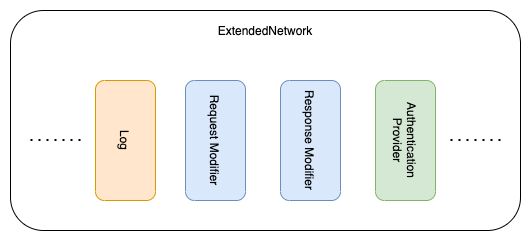
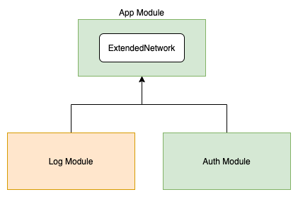
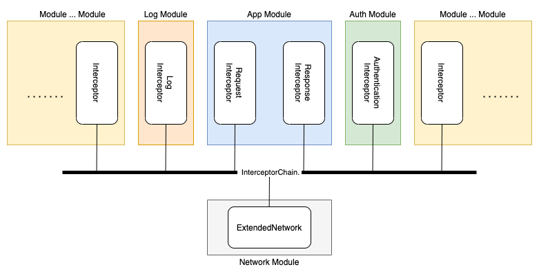
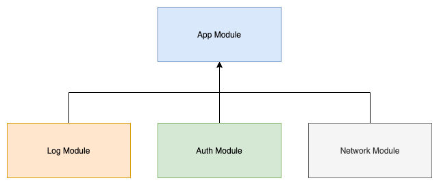

# Volley Interceptor

#### Preparation

This is built for Volley, an HTTP library that makes networking for Android, created by Google

[Volley](https://developer.android.com/training/volley)

The concept of the interceptor is based on the Retrofit, another HTTP library that created by Square

[Retofit](https://square.github.io/retrofit)

If you don't know the concept of interceptor in Retrofit, please take a look this page

[Interceptor](https://square.github.io/okhttp/interceptors)

### Background

Volley is bit old library, but still many people are using it.

In order to modify the request / response, the most straight forward solution is overriding `BasicNetwork`, such as

```
class ExtendedNetwork: BasicNetwork {
    override fun performRequest(request: Request<*>): NetworkResponse {
        // Do whatever you want for the request
        val response = super.performRequest(request)
        // Do whatever you want for the response
        return response
    }
}
```

However, if your application is big and complicated. The function `performRequest` may become messy and sticky to other functions / modules.

### Idea

Originally, we put all the implementation to the ExtendedNetwork class.

Even you can put the actual implementation in to separated class, the class ExtendedNetwork still growth when there are more features.



To archive the implementation, your module dependency would looks like following



It looks bit weird since network module should be base / fundamental level of the project.

With the concept of interceptor from Retrofit, we could decouple and simply the implementation for the `ExtendedNetwork`.



The dependency graph will be changed as following, it looks more reasonable.



### Example

[Implementation of Interceptor](app/src/main/java/com/codedeco/lib/volley/example/interception)

### Integration Guideline

1. Include the source in lib-volley
2. Prepare your interceptor

```
class MyInterceptor : Interceptor {
    override fun intercept(chain: Interceptor.Chain): NetworkResponse? {
        // TODO, your implementation
    }
}

class AnotherInterceptor : Interceptor {
    override fun intercept(chain: Interceptor.Chain): NetworkResponse? {
        // TODO, your implementation
    }
}
```

3. Use the `ExtendedNetwork` from [app/src/main/java/com/codedeco/lib/volley](app/src/main/java/com/codedeco/lib/volley)
```
class MyNetworkProvider {
    fun provideNetwork(): Network {
        return ExtendedNetwork()
            .addInterceptor(MyInterceptor()) // function to add interceptor 1 by 1
            .addInterceptors(listOf(         // function to add batch of interceptors
                AnotherInterceptor()
            ))
    }
}
```

P.S. The order of execution is same as the order that added to the `ExtendedNetwork`.
